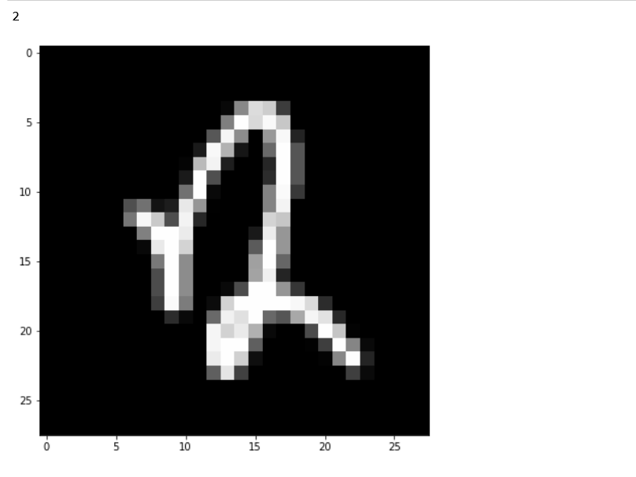
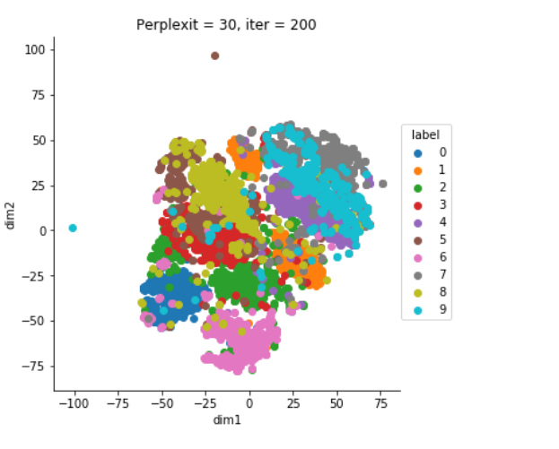

# Digit Recognizer
This repository contains the python script to classify the hand written digits . This case study is used to practice and get familiar with the basics of machine learning ,it is also known as "Hello world" of ML . 
## Data set
The data set which is used for the classification is **MNIST**  data set. It contains BW images of handwritten digits(0-9) in the pixelated form . The images are normalized to fit into a 28x28 pixel box which is then flatten in a tuple with 782 attributes plus one attribute for the label. 
- Example of a hand written digit :-

* Language - Python

- Example of visualization :-

* This repository contains models which are based on ML concepts and algorithms .Deep learning concepts and architecture can be used to achieve better results .Code available here :- https://github.com/Vipul05/DL-Neural-network
### ;)
